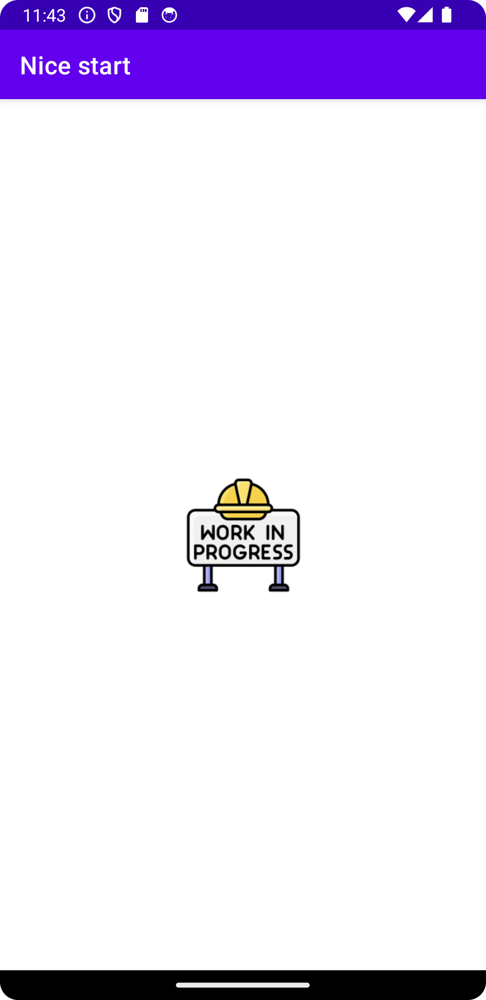

## Nicestart - Martín Guijarro

### DAM2 - Desarrollo de interfaces

- [Pantalla de carga](https://github.com/martinguijarro/nicestart/blob/main/app/src/main/res/layout/activity_splash.xml):

- [Pantalla de inicio de sesión](https://github.com/martinguijarro/nicestart/blob/main/app/src/main/res/layout/activity_login.xml):

- [Pantalla de registo](https://github.com/martinguijarro/nicestart/blob/main/app/src/main/res/layout/activity_signup.xml):

- [Pantalla principal](https://github.com/martinguijarro/nicestart/blob/main/app/src/main/res/layout/activity_main.xml):

- [Pantalla nopeople](https://github.com/martinguijarro/nicestart/blob/main/app/src/main/res/layout/activity_nopeople.xml):

#### Al hacer el gesto de refrescar, cambia aleatoriamente el orden de los elementos

